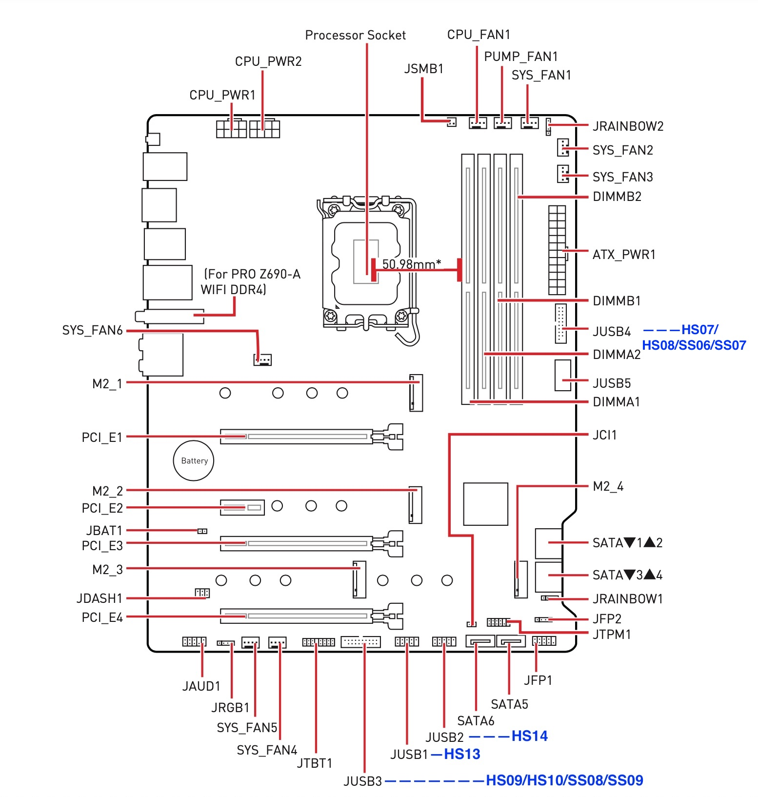
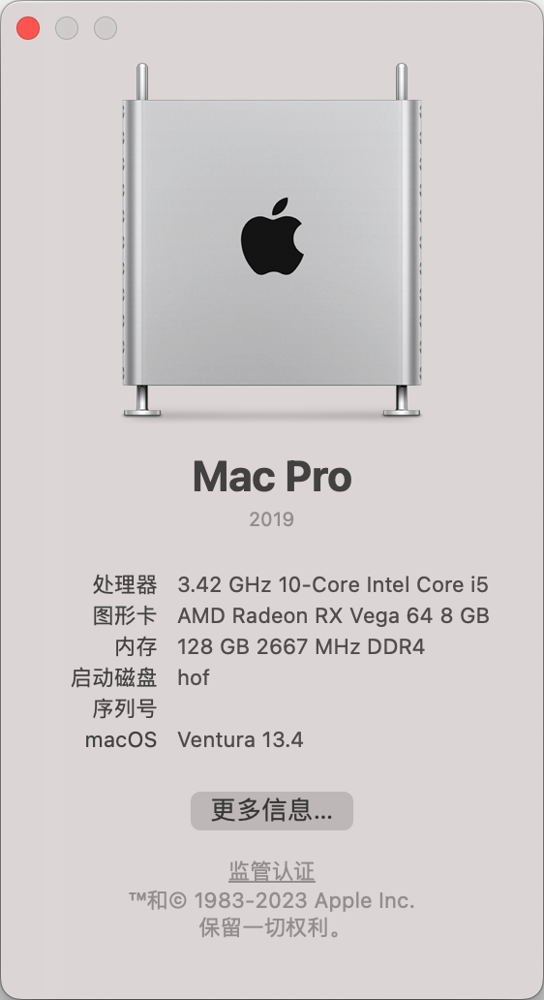
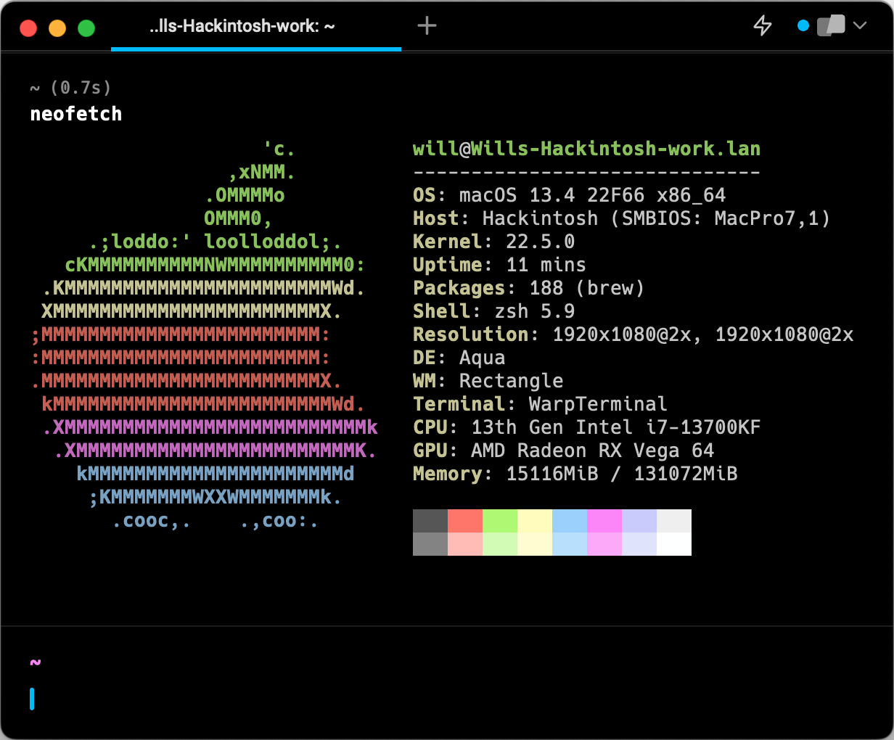
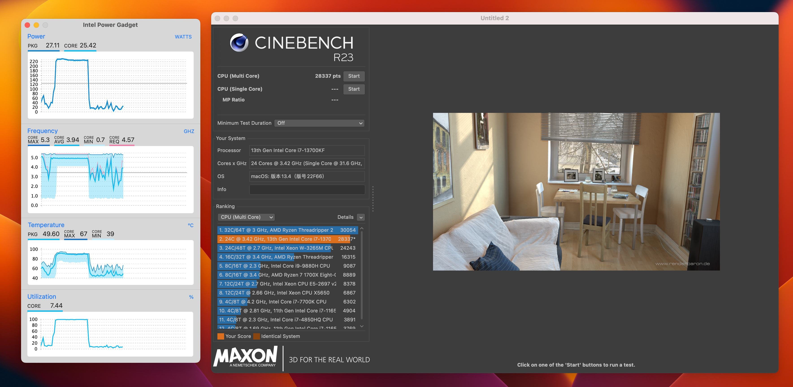
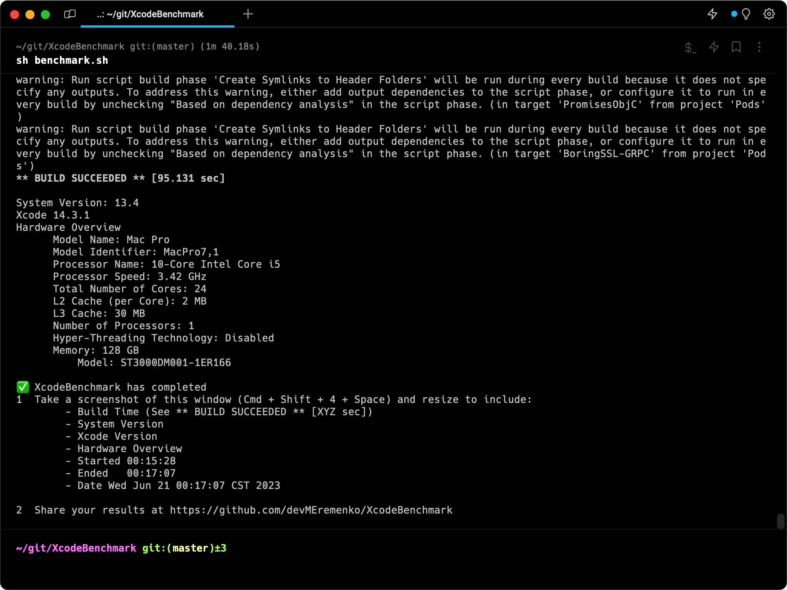
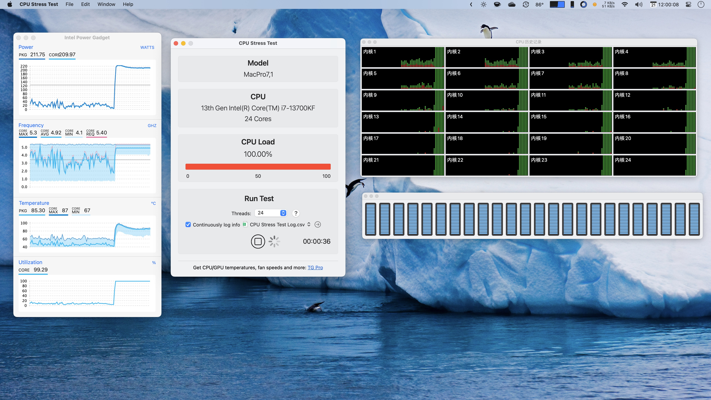
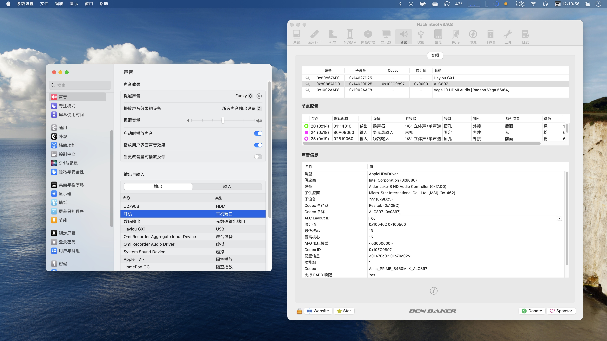

# MSI-PRO-Z690-A-DDR4-i7-13700KF-Hackintosh-EFI

抄作业 [yutianhot](https://github.com/yutianhot) 的 https://github.com/yutianhot/MSI-PRO-Z690-A-Wi-Fi-DDR4-i5-12600KF-Hackintosh-EFI

开机直接能用，好评💯

在此基础上添加有线网卡的驱动。

> 更新 Sonoma EFI，需要配合OpenCore Legacy Patcher(OCLP），完整教程见：[为Sonoma驱动博通无线网卡的详细步骤](https://bbs.pcbeta.com/viewthread-1975545-1-1.html)

## 机器配置

前段时间搬家时水冷没有扭紧，脱落导致划伤CPU基座和SSD，痛心❣️。

最近有空，把i9 9900K闲鱼卖了2270元，2640元买了13700KF，倒是很划算。1200元买了MSI Z690-A，其余都是原来的配件。

主板：[微星 MSI PRO Z690-A DDR4](https://www.msicn.com.cn/Motherboard/PRO-Z690-A-DDR4/Overview)

CPU：[Intel i7 13700KF](https://www.intel.com/content/www/us/en/products/sku/230489/intel-core-i713700kf-processor-30m-cache-up-to-5-40-ghz/specifications.html)

内存：阿斯加特 DDR4 2666 32G*4

显卡：[华硕 ASUS AREZ-STRIX-RXVEGA64-O8G-GAMING](https://www.asus.com/us/Graphics-Cards/AREZ-STRIX-RXVEGA64-O8G-GAMING/)

电源：振华电源 LEADEX G 1000W

散热：[追风者 GLACIER ONE 360MP](https://phanteks.com/Glacier-One-MP.html)

固态：影驰名人堂HOF PRO M.2 PCIe 4.0 2280 1TB

板载声卡：ALC897

板载有线网卡：Intel Ethernet Controller I225-V

无线网卡和蓝牙：BCM94360CD

显示器：AOC U28P2U 4K显示器 + AOC U2790PQU 4K显示器

机箱：[追风者 PK-515ETG](http://www.phanteks.com/Enthoo-Evolv-ATX-TemperedGlass.html)

## USB定制

参考：

- [MSI PRO Z690-A DDR4 USB Ports Identified](https://www.tonymacx86.com/threads/msi-pro-z690-a-ddr4-i7-12700k-amd-rx-580.319149/page-4#post-2311844)

- [黑苹果用USBToolBox定制USB](https://gewill.org/2022/12/14/Custom-USB-for-hackintosh-by-USBToolBox/)

编辑 [USBPortsNATA-All Possible Ports EDIT ME V2.kext](./EFI/OC/Kexts/USBPortsNATA-All Possible Ports EDIT ME V2.kext) 移除多余的USB端口，保留15个以下即可。

## 性能测试

XcodeBenchmark 有点慢，低于M1 Max：

CPU Stress Test 满载运行，发现大小核均正常工作，24 个核心全部跑满：

声卡工作比较完美，支持前置音频接口自动识别为耳机：

